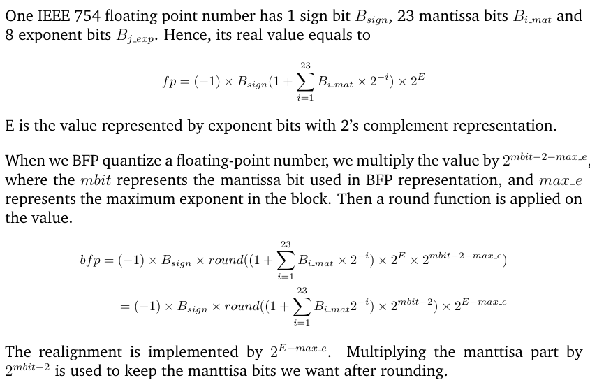

# 1. BFP_DNN 
Deploy Block Floating Point Quantization for Deep Neural Network
The whole implementation is based on [Pytorch.0.4.1](https://pytorch.org/get-started/previous-versions/).
## 1.1. Novelty 
Essentially, Block floating point(BFP) can be viewed as logarithmic quantization. Previous works [[1](https://arxiv.org/abs/1709.07776),[2](https://ieeexplore.ieee.org/stamp/stamp.jsp?arnumber=8533510), [3](https://github.com/ActiveVisionLab/DSConv)] have explored the BFP quantization for DNN. However, there are several drawbacks:
1. **Significant accuracy loss** on lightweight CNN models(Inceptionv4, mobilenetv2) for large datasets. Althogh these works show excellent accuracy on Alexnet when evaluating on **small datasets** such Cifar10 and UCF101, our experiments  that the accuracy drops a lot on Imagenet12 for inceptionv4 and mobilenetv2.
1. **Difficulty in hardware implementation**. In previous works, the share exponent for a block of BFP is maximum exponent determined **during the runtime (online)**. Such kind of method requires extra time cost and harware resource to find the maximum exponent and perform the realignment for each layer.

In this work, we propose the **off-line** BFP quantization where the shared exponent is deternmined before the DNN is deployed on the real FPGA-accelerator. 
Before BFP quantization, we first run the target DNN on several example images to collect the target distribution of the intermediate results in each layer. Instead of using the maximum exponent, the shared exponent is determined by minimizing the Kullback–Leibler divergence between the target distribution and quantized distribution.


# 2. Content
<!-- TOC -->

- [1. BFP_DNN](#1-bfp_dnn)
    - [1.1. Novelty](#11-novelty)
- [2. Content](#2-content)
    - [2.1. How to implement the BFP quantization in pytorch](#21-how-to-implement-the-bfp-quantization-in-pytorch)
    - [2.2. How to prepare the validation dataset](#22-how-to-prepare-the-validation-dataset)
    - [2.3. How to test resnet50 and inceptionv4](#23-how-to-test-resnet50-and-inceptionv4)
    - [2.4. Visuallization: TensorboardX](#24-visuallization-tensorboardx)
        - [2.4.1. Installation](#241-installation)
        - [2.4.2. Usage](#242-usage)
- [3. Citation and reference git repo](#3-citation-and-reference-git-repo)

<!-- /TOC -->
## 2.1. How to implement the BFP quantization in pytorch
Here is the explaination:

---------------------------------------------------------------------------------------------------------------->


---------------------------------------------------------------------------------------------------------------->

Here is the implementation of above BFP quantization process: [here](https://github.com/os-hxfan/BFP_DNN/blob/f53c6e633ace8decf7ecc0c3bb802cd31e94cdc6/lib/Utils.py#L369)

1. The code of weight BFP quantization is [here](https://github.com/os-hxfan/BFP_DNN/blob/67fccecba17e696480433cdc5220a86d05c3c8e5/lib/BFPConvertor.py#L103)
1. The code of bias BFP quantization is [here](https://github.com/os-hxfan/BFP_DNN/blob/67fccecba17e696480433cdc5220a86d05c3c8e5/lib/BFPConvertor.py#L106)
1. The code of activation BFP quantization is [here](https://github.com/os-hxfan/BFP_DNN/blob/67fccecba17e696480433cdc5220a86d05c3c8e5/models/resnet.py#L49)
1. The code of BFP shortcut quantization is [here](https://github.com/os-hxfan/BFP_DNN/blob/67fccecba17e696480433cdc5220a86d05c3c8e5/models/resnet.py#L105)
1. The code of BFP concatenate quantization is [here](https://github.com/os-hxfan/BFP_DNN/blob/67fccecba17e696480433cdc5220a86d05c3c8e5/models/inceptionv4.py#L172)

## 2.2. How to prepare the validation dataset
1. Download [Imagenet12](http://www.image-net.org/challenges/LSVRC/2012/nonpub-downloads) validation set
1. untar and name it as `cr_val`
1. cp `script/groundtruth.txt` and `script/creat_corerain_valset.sh` to your `cr_val`
1. `sh creat_corerain_valset.sh`
2. `rm *JPEG`

## 2.3. How to test resnet50 and inceptionv4
Make sure you have installed [Pytorch.0.4.1](https://pytorch.org/get-started/previous-versions/).
```
pip install torch==0.4.1
pip install torchvision==0.2.1
pip install pretrainedmodels
```
Then you can run
```
sh script/bfp_quant_resnet.sh
sh script/bfp_quant_inceptionv4.sh
```
in the main directory of this repo

On my side, the result on Imagenet-50000-val is 

|   | floating point | BFP (8-bit mantissa)|Loss|
|---|---|---|---|
| resnet50 |  76.13% |  75.758% (act_factor 4) | 0.372% |
|  inceptionv4 | 80.14%  |  79.866% | 0.274% |
|   vgg    | 71.592% | 71.302% | 0.29% |


on Corerain-5000-val is 

|   | floating point | BFP (8-bit mantissa)|Loss|
|---|---|---|---|
| resnet50 |  77.28% |  76.30% (act_factor 2) | 0.98% |
|  inceptionv4 | 80.40%  |  80.3% | 0.10% |
|   vgg    | 72.28% | 72.0% | 0.28% |

## 2.4. Visuallization: TensorboardX
### 2.4.1. Installation
```
# To make sure the tf and tb have the same version, uninstall all 
pip uninstall tensorflow
pip uninstall tensorboard
pip uninstall tensorflow-tensorboard
# Install tf and tb with the verison, Install tbX for pytorch
pip install tensorflowe==1.12.0
pip install tensorboard==1.12.0
pip install tensorboardX
```
### 2.4.2. Usage
In pytorch, 
```
from tensorboardX import SummaryWriter
log_dir = "./tensorboard/statistic" # where to save the log files
writer = SummaryWriter(log_dir)
.....
writer.close()
```
After running the program, the `even.tf` file will be in your `log_dir`.

If you are using the server:
1. In your local machine, use command line: `ssh -NfL 8006:localhost:8006 user@ip.address` to bin the remote port
2. In server, type: `tensorboard --logdir=/abs/path/to/log/dir/ --port=8006`

If you are using local machine, no need the above procedure.

In the end, open browser such Chrome, open web page `http://localhost:8006/`

# 3. Citation and reference git repo
**Thanks for their contribution!!!**
1. Hook to get Intermediate result: [code](https://github.com/TheShadow29/FAI-notes/blob/master/notebooks/Using-Forward-Hook-To-Save-Features.ipynb) note: the input_feature is tuple, needs `[]` to index
2. DSConv: [[code](https://github.com/ActiveVisionLab/DSConv)], [[paper](https://arxiv.org/abs/1901.01928)]
3. BFP for 3D conv: [[paper](https://ieeexplore.ieee.org/stamp/stamp.jsp?arnumber=8533510)]


